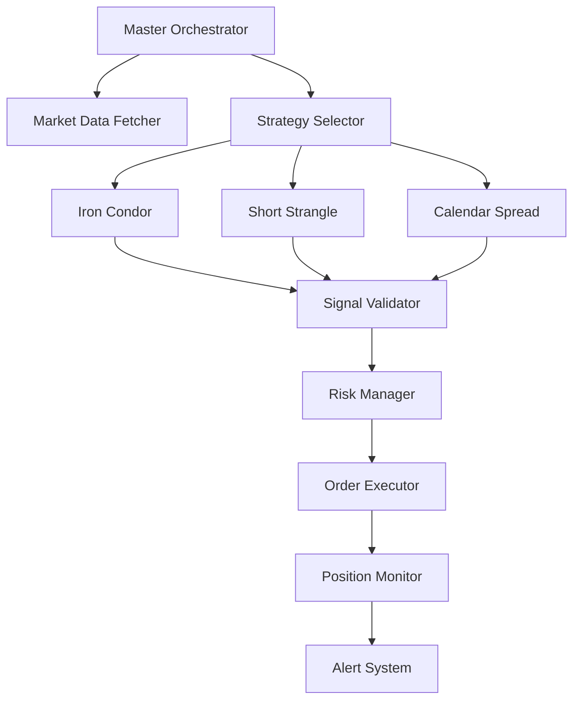

# 📚 Complete n8n Workflow Setup Guide for Options Trading

## 🎯 Overview
This guide will walk you through creating the best n8n workflows for your options trading system, from basic setup to advanced multi-strategy orchestration.

## 📋 Workflow Architecture



---

## 🚀 Step 1: Initial n8n Setup

### 1.1 Access n8n Dashboard
```bash
# Open in browser
http://localhost:5678

# Default credentials
Username: admin
Password: changeme  # Change this immediately!
```

### 1.2 Configure Credentials
1. Go to **Credentials** (left sidebar)
2. Click **Add Credential**
3. Add the following:

#### Kite API Credential
```json
{
  "name": "Kite API",
  "type": "HTTP Header Auth",
  "properties": {
    "headerName": "Authorization",
    "headerValue": "token YOUR_ACCESS_TOKEN"
  }
}
```

#### PostgreSQL Database
```json
{
  "name": "Trading DB",
  "type": "PostgreSQL",
  "properties": {
    "host": "postgres",
    "port": 5432,
    "database": "trading_db",
    "user": "trader",
    "password": "your_password"
  }
}
```

#### Telegram Bot
```json
{
  "name": "Trading Alerts",
  "type": "Telegram",
  "properties": {
    "accessToken": "YOUR_BOT_TOKEN",
    "chatId": "YOUR_CHAT_ID"
  }
}
```

---

## 🔧 Step 2: Import Base Workflows

### 2.1 Import Existing Workflows
1. Click **Workflows** → **Import from File**
2. Import these files in order:
   - `01_kite_auth_workflow.json`
   - `02_options_strategy_workflow.json`
   - `03_iron_condor_strategy.json`
   - `MASTER_TRADING_ORCHESTRATOR.json`

### 2.2 Configure Workflow IDs
After importing, note down each workflow's ID:
1. Open workflow → Settings → Copy Workflow ID
2. Update references in Master Orchestrator

---

## 🎨 Step 3: Create Custom Workflows

### Workflow 1: Daily Token Refresher
**Purpose:** Automatically refresh Kite access token at market open

```javascript
// Node 1: Schedule Trigger
{
  "cronExpression": "0 9 * * 1-5"  // 9:00 AM Mon-Fri
}

// Node 2: HTTP Request to Kite Login
// This requires manual intervention initially
// Consider using Puppeteer node for automation

// Node 3: Store Token in Database
{
  "query": "UPDATE trading.auth_tokens SET token_value = $1, expires_at = NOW() + INTERVAL '8 hours' WHERE token_type = 'kite_access'"
}
```

### Workflow 2: Real-Time Market Scanner
**Purpose:** Continuously scan for trading opportunities

```javascript
// Node 1: Cron Trigger (Every 30 seconds during market hours)
{
  "cronExpression": "*/30 * 9-15 * * 1-5"
}

// Node 2: Parallel Data Fetching
// Split into multiple HTTP nodes for efficiency
const symbols = [
  'NSE:NIFTY 50',
  'NSE:NIFTY BANK',
  'NSE:INDIA VIX'
];

// Node 3: Technical Analysis
const indicators = {
  rsi: calculateRSI(prices, 14),
  macd: calculateMACD(prices),
  bollingerBands: calculateBB(prices, 20),
  vwap: calculateVWAP(prices, volumes)
};

// Node 4: Pattern Recognition
const patterns = {
  support: findSupportLevels(prices),
  resistance: findResistanceLevels(prices),
  trendline: detectTrendline(prices)
};

return {
  timestamp: new Date(),
  signals: analyzeSignals(indicators, patterns)
};
```

### Workflow 3: Multi-Strategy Orchestrator
**Purpose:** Run multiple strategies in parallel and select best opportunity

```javascript
// Node 1: Webhook Trigger (Can be called by Master or MCP)
{
  "path": "execute-strategies",
  "method": "POST"
}

// Node 2: Parallel Strategy Execution
// Use Execute Workflow node for each strategy
const strategies = [
  { id: 'iron_condor_workflow_id', weight: 0.4 },
  { id: 'short_strangle_workflow_id', weight: 0.3 },
  { id: 'calendar_spread_workflow_id', weight: 0.3 }
];

// Node 3: Aggregate Scores
const aggregatedScore = strategies.reduce((total, strategy, index) => {
  const result = $item(index).json;
  return total + (result.score * strategy.weight);
}, 0);

// Node 4: Select Best Strategy
const bestStrategy = strategies.reduce((best, current, index) => {
  const result = $item(index).json;
  if (result.score > best.score) {
    return { strategy: current, result: result };
  }
  return best;
}, { score: 0 });

return {
  selected_strategy: bestStrategy.strategy,
  aggregated_score: aggregatedScore,
  individual_scores: strategies.map((s, i) => ({
    strategy: s.id,
    score: $item(i).json.score
  }))
};
```

### Workflow 4: Advanced Risk Manager
**Purpose:** Comprehensive risk checks before order placement

```javascript
// Node 1: Input from Strategy
const signal = $input.first().json;

// Node 2: Portfolio Risk Check
const portfolioRisk = await $node['Database'].executeQuery({
  query: `
    SELECT 
      COUNT(*) as open_positions,
      SUM(margin_used) as total_margin,
      SUM(CASE WHEN pnl < 0 THEN pnl ELSE 0 END) as unrealized_loss,
      MAX(correlation) as max_correlation
    FROM trading.positions
    WHERE status = 'OPEN'
  `
});

// Node 3: Calculate Position Size (Kelly Criterion)
const kellyCriterion = (winRate, avgWin, avgLoss) => {
  const b = avgWin / avgLoss;
  const p = winRate;
  const q = 1 - p;
  const f = (p * b - q) / b;
  
  // Apply safety factor
  return Math.max(0, Math.min(f * 0.25, 0.05)); // Max 5% per trade
};

const historicalStats = await getHistoricalStats(signal.strategy);
const optimalSize = kellyCriterion(
  historicalStats.winRate,
  historicalStats.avgWin,
  historicalStats.avgLoss
);

// Node 4: Correlation Check
const correlation = await calculateCorrelation(signal.symbol, portfolioRisk.positions);

// Node 5: Risk Decision
const riskScore = {
  portfolio_risk: portfolioRisk.unrealized_loss < -20000 ? 0 : 100,
  position_count: portfolioRisk.open_positions < 5 ? 100 : 0,
  correlation: correlation < 0.7 ? 100 : 50,
  margin_available: portfolioRisk.total_margin < 500000 ? 100 : 0
};

const totalRiskScore = Object.values(riskScore).reduce((a, b) => a + b) / Object.keys(riskScore).length;

return {
  approved: totalRiskScore >= 75,
  position_size: optimalSize * capital,
  risk_metrics: riskScore,
  recommendation: totalRiskScore >= 75 ? 'PROCEED' : 'REJECT'
};
```

### Workflow 5: Smart Order Executor
**Purpose:** Place orders with advanced logic

```javascript
// Node 1: Receive Approved Signal
const order = $input.first().json;

// Node 2: Order Slicing (for large orders)
const sliceOrder = (totalQuantity, maxSliceSize = 100) => {
  const slices = [];
  let remaining = totalQuantity;
  
  while (remaining > 0) {
    const slice = Math.min(remaining, maxSliceSize);
    slices.push({
      quantity: slice,
      delay: slices.length * 500 // 500ms between slices
    });
    remaining -= slice;
  }
  return slices;
};

// Node 3: Place Orders with Retry Logic
for (const slice of orderSlices) {
  let attempts = 0;
  let success = false;
  
  while (attempts < 3 && !success) {
    try {
      const response = await placeOrder({
        symbol: order.symbol,
        quantity: slice.quantity,
        order_type: 'LIMIT',
        price: calculateLimitPrice(order.ltp, order.side)
      });
      
      success = true;
      await logOrder(response);
    } catch (error) {
      attempts++;
      if (attempts >= 3) {
        await sendAlert('Order failed after 3 attempts', error);
      }
      await sleep(1000 * attempts); // Exponential backoff
    }
  }
}

// Node 4: Set Stop Loss and Targets
const stops = {
  initial_stop: order.entry_price * 0.98,
  target_1: order.entry_price * 1.03,
  target_2: order.entry_price * 1.05,
  trailing_stop: false
};

// Node 5: Store Order Details
await storeOrderDetails(order, stops);
```

---

## 🔄 Step 4: Workflow Connections

### Connect Workflows Together
1. **Master → Strategies**: Use Execute Workflow nodes
2. **Strategies → Risk Manager**: HTTP Request or Execute Workflow
3. **Risk Manager → Order Executor**: Conditional execution
4. **All Workflows → Alert System**: Telegram/Email nodes

### Set Up Error Handling
```javascript
// Add Error Workflow
{
  "name": "Error Handler",
  "nodes": [
    {
      "type": "errorTrigger",
      "parameters": {}
    },
    {
      "type": "telegram",
      "parameters": {
        "text": "❌ Error in {{$node.error.workflow}}: {{$node.error.message}}"
      }
    },
    {
      "type": "postgres",
      "parameters": {
        "query": "INSERT INTO trading.errors (workflow, error, timestamp) VALUES ($1, $2, NOW())"
      }
    }
  ]
}
```

---

## 🎮 Step 5: MCP Integration

### Expose Workflows to Windsurf MCP

1. **Create MCP Endpoints**
```javascript
// Webhook node configuration for MCP
{
  "httpMethod": "POST",
  "path": "mcp-{{strategy_name}}",
  "authentication": "headerAuth",
  "responseMode": "onReceived",
  "responseData": {
    "success": true,
    "workflow_id": "={{$execution.id}}",
    "status": "processing"
  }
}
```

2. **Configure Streaming Responses**
```javascript
// For real-time updates back to Windsurf
const sseResponse = {
  "responseMode": "sse",
  "keepAlive": true,
  "responseHeaders": {
    "Content-Type": "text/event-stream",
    "Cache-Control": "no-cache"
  }
};
```

---

## 📊 Step 6: Monitoring & Analytics

### Create Performance Dashboard Workflow
```javascript
// Runs every hour to calculate metrics
{
  "name": "Performance Analytics",
  "schedule": "0 * * * *",
  "nodes": [
    {
      "name": "Calculate Metrics",
      "query": `
        SELECT 
          DATE(created_at) as date,
          COUNT(*) as trades,
          SUM(CASE WHEN pnl > 0 THEN 1 ELSE 0 END)::float / COUNT(*) as win_rate,
          AVG(pnl) as avg_pnl,
          STDDEV(pnl) as pnl_stddev,
          MAX(pnl) as best_trade,
          MIN(pnl) as worst_trade
        FROM trading.orders
        WHERE created_at >= NOW() - INTERVAL '30 days'
        GROUP BY DATE(created_at)
      `
    },
    {
      "name": "Calculate Sharpe Ratio",
      "code": "return avgReturn / stdDev * Math.sqrt(252)"
    },
    {
      "name": "Send Daily Report",
      "telegram": "📊 Daily Performance:\nWin Rate: {{win_rate}}%\nSharpe: {{sharpe}}\nTotal P&L: ₹{{total_pnl}}"
    }
  ]
}
```

---

## 🚦 Step 7: Testing Your Workflows

### 7.1 Test Individual Components
```bash
# Test webhook endpoint
curl -X POST http://localhost:5678/webhook/iron-condor-signal \
  -H "Content-Type: application/json" \
  -d '{"symbol":"NIFTY","spot_price":21500}'
```

### 7.2 Simulate Market Conditions
Create a test workflow that simulates different market scenarios:
- High volatility
- Trending market
- Range-bound market
- Gap openings

### 7.3 Paper Trading Mode
Add a flag in all order execution nodes:
```javascript
if (process.env.PAPER_TRADING === 'true') {
  // Log order instead of placing
  return { paper_order: order, status: 'simulated' };
} else {
  // Place real order
  return await placeRealOrder(order);
}
```

---

## 💡 Best Practices

### 1. **Use Sub-Workflows**
Break complex logic into smaller, reusable workflows

### 2. **Implement Circuit Breakers**
```javascript
// Stop trading after X consecutive losses
if (consecutiveLosses >= 3) {
  await disableAllStrategies();
  await sendUrgentAlert('Circuit breaker triggered');
}
```

### 3. **Version Control**
Export workflows regularly:
```bash
# Create backup script
n8n export:workflow --all --output=./backups/workflows_$(date +%Y%m%d).json
```

### 4. **Use Environment Variables**
Store sensitive data and configuration in n8n environment:
```javascript
const config = {
  maxPositions: parseInt($env.MAX_POSITIONS) || 5,
  maxRiskPerTrade: parseFloat($env.MAX_RISK) || 0.02
};
```

### 5. **Add Comprehensive Logging**
```javascript
// Log every decision point
await logDecision({
  workflow: $workflow.name,
  node: $node.name,
  decision: result,
  factors: scoringFactors,
  timestamp: new Date()
});
```

---

## 🔥 Advanced Features

### Real-Time Streaming to Windsurf
```javascript
// SSE endpoint for live updates
const eventSource = new EventSource('http://localhost:5678/webhook/market-stream');
eventSource.onmessage = (event) => {
  const data = JSON.parse(event.data);
  // Process real-time market data
};
```

### Machine Learning Integration
```python
# Add Python node for ML predictions
import joblib
model = joblib.load('/models/option_predictor.pkl')
features = extract_features(market_data)
prediction = model.predict(features)
return {'signal': prediction[0], 'confidence': prediction[1]}
```

### Multi-Account Management
```javascript
// Handle multiple trading accounts
const accounts = ['account1', 'account2'];
for (const account of accounts) {
  const signal = await generateSignal(account);
  if (signal.score > threshold) {
    await executeForAccount(account, signal);
  }
}
```

---

## 📞 Connecting Everything with MCP

In Windsurf, you can now call:
```
@n8n-mcp execute {"workflow": "iron_condor", "params": {"symbol": "NIFTY"}}
@n8n-mcp get_performance {"period": "7d"}
@n8n-mcp stop_all_strategies
@n8n-mcp get_open_positions
```

---

## 🎯 Next Steps

1. Start with the Master Orchestrator
2. Add one strategy at a time
3. Test thoroughly in paper mode
4. Monitor performance metrics
5. Gradually increase automation
6. Add more sophisticated strategies

Remember: **Start simple, test everything, and scale gradually!**
