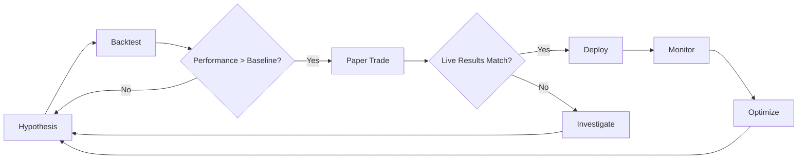

# Professional Options Trading Setup Guide
## Zerodha + n8n + Windsurf Integration

## 📋 Table of Contents
1. [Phase 1: Foundation Setup](#phase-1-foundation-setup)
2. [Phase 2: Core Trading Infrastructure](#phase-2-core-trading-infrastructure)
3. [Phase 3: Strategy Layers](#phase-3-strategy-layers)
4. [Phase 4: Risk Management](#phase-4-risk-management)
5. [Phase 5: Testing & Validation](#phase-5-testing-validation)
6. [Phase 6: Production Deployment](#phase-6-production-deployment)
7. [Phase 7: Continuous Improvement](#phase-7-continuous-improvement)

---

## Phase 1: Foundation Setup

### 1.1 Zerodha Developer Account
```bash
# Requirements
- Zerodha Trading Account
- Kite Connect Developer Account (~₹2000/month)
- API Key & Secret from console.zerodha.com
```

### 1.2 Infrastructure Setup
```yaml
# docker-compose.yml
version: '3.8'
services:
  n8n:
    image: n8nio/n8n:latest
    ports:
      - "5678:5678"
    environment:
      - N8N_BASIC_AUTH_ACTIVE=true
      - N8N_BASIC_AUTH_USER=admin
      - N8N_BASIC_AUTH_PASSWORD=your_secure_password
      - N8N_ENCRYPTION_KEY=your_encryption_key
    volumes:
      - ./n8n_data:/home/node/.n8n
    restart: unless-stopped

  postgres:
    image: postgres:14
    environment:
      POSTGRES_DB: trading_db
      POSTGRES_USER: trader
      POSTGRES_PASSWORD: secure_password
    volumes:
      - ./postgres_data:/var/lib/postgresql/data
    ports:
      - "5432:5432"
    restart: unless-stopped

  redis:
    image: redis:7-alpine
    ports:
      - "6379:6379"
    restart: unless-stopped
```

### 1.3 Database Schema
```sql
-- Strategy configurations
CREATE TABLE trading.strategies (
    id SERIAL PRIMARY KEY,
    name VARCHAR(100) UNIQUE NOT NULL,
    enabled BOOLEAN DEFAULT false,
    priority INTEGER DEFAULT 0,
    config JSONB NOT NULL,
    created_at TIMESTAMP DEFAULT NOW()
);

-- Trade signals
CREATE TABLE trading.signals (
    id SERIAL PRIMARY KEY,
    strategy_id INTEGER REFERENCES trading.strategies(id),
    symbol VARCHAR(50) NOT NULL,
    signal_type VARCHAR(20) NOT NULL,
    strength DECIMAL(5,2),
    metadata JSONB,
    created_at TIMESTAMP DEFAULT NOW()
);

-- Order history
CREATE TABLE trading.orders (
    id SERIAL PRIMARY KEY,
    order_id VARCHAR(50) UNIQUE,
    signal_id INTEGER REFERENCES trading.signals(id),
    symbol VARCHAR(50) NOT NULL,
    order_type VARCHAR(20),
    quantity INTEGER,
    price DECIMAL(10,2),
    status VARCHAR(20),
    metadata JSONB
);
```

---

## Phase 2: Core Trading Infrastructure

### 2.1 n8n Core Workflows

#### Workflow 1: Kite Authentication Manager
- **Schedule**: Daily at 9:00 AM IST
- **Purpose**: Refresh access token
- **Nodes**: Schedule Trigger → HTTP Request (Kite API) → Store Token

#### Workflow 2: Market Data Fetcher  
- **Schedule**: Every 1 minute during market hours
- **Purpose**: Fetch option chain, spot prices
- **Nodes**: Cron Trigger → Kite Quote API → Store in Redis

#### Workflow 3: Signal Generator
- **Trigger**: Market data update
- **Purpose**: Run strategy layers, generate signals
- **Nodes**: Redis Trigger → Strategy Functions → Signal Aggregator → Database

#### Workflow 4: Order Executor
- **Trigger**: High-confidence signals
- **Purpose**: Place orders with risk checks
- **Nodes**: Signal Trigger → Risk Validator → Order API → Status Monitor

---

## Phase 3: Strategy Layers

### 3.1 Layer Architecture
```yaml
layers:
  primary:
    - technical_indicators (40% weight)
    - options_greeks (30% weight)
    - volume_analysis (20% weight)
    - market_sentiment (10% weight)
  
  confirmation:
    - risk_metrics
    - position_sizing
    - exit_conditions

scoring:
  min_score: 70  # Minimum to trigger trade
```

### 3.2 Technical Indicator Strategy
Key indicators:
- RSI (14) - Oversold/Overbought
- MACD - Momentum shifts  
- EMA 9/21 - Trend direction
- Bollinger Bands - Volatility squeeze
- Supertrend - Dynamic support/resistance

### 3.3 Options Greeks Strategy
Ideal ranges for option selling:
- Delta: 0.25-0.35 (25-35% probability ITM)
- Theta: > -50 (good decay)
- IV Percentile: > 60 (high IV environment)
- Gamma: < 0.02 (low acceleration risk)

---

## Phase 4: Risk Management

### 4.1 Position Sizing Rules
```javascript
const positionSize = Math.min(
  kellyFraction * capital,
  maxRiskPerTrade / stopLoss,
  capital * maxPositionPercent
);
```

### 4.2 Stop Loss & Targets
- Initial Stop: 2% of capital or technical level
- Trailing Stop: 50% of unrealized profit
- Target 1: 1.5x risk (50% exit)
- Target 2: 2.5x risk (30% exit)
- Runner: Trailing stop (20%)

### 4.3 Daily Risk Limits
- Max daily loss: 3% of capital
- Max open positions: 5
- Max correlation between positions: 0.7
- Intraday leverage: 2x max

---

## Phase 5: Testing & Validation

### 5.1 Backtesting Framework
```python
# backtest.py
import pandas as pd
from datetime import datetime, timedelta

def backtest_strategy(strategy, data, capital=1000000):
    results = {
        'trades': [],
        'equity_curve': [capital],
        'metrics': {}
    }
    
    for date in data.index:
        signal = strategy.generate_signal(data.loc[date])
        if signal.action != 'WAIT':
            # Simulate trade execution
            trade = execute_trade(signal, capital)
            results['trades'].append(trade)
            capital += trade['pnl']
            results['equity_curve'].append(capital)
    
    # Calculate metrics
    results['metrics'] = {
        'total_return': (capital - 1000000) / 1000000,
        'sharpe_ratio': calculate_sharpe(results['equity_curve']),
        'max_drawdown': calculate_max_dd(results['equity_curve']),
        'win_rate': calculate_win_rate(results['trades'])
    }
    
    return results
```

### 5.2 Paper Trading Setup
1. Use Kite's sandbox environment
2. Mirror all real signals to paper account
3. Track performance for 30 days minimum
4. Compare with backtest results

---

## Phase 6: Production Deployment

### 6.1 Pre-Production Checklist
- [ ] All strategies backtested (min 2 years data)
- [ ] Paper trading successful (min 30 days)
- [ ] Risk management tested
- [ ] Error handling implemented
- [ ] Monitoring & alerts configured
- [ ] Daily backup scripts ready

### 6.2 Go-Live Process
1. Start with 10% of intended capital
2. Single strategy activation
3. Manual approval for first week
4. Gradual automation increase
5. Full deployment after 1 month

### 6.3 Monitoring Setup
```yaml
alerts:
  - type: position_loss
    threshold: -5000
    channel: telegram
  
  - type: daily_loss
    threshold: -30000
    channel: email
    action: stop_trading
  
  - type: api_error
    retry: 3
    channel: slack
  
  - type: unusual_volume
    threshold: 2x_average
    channel: telegram
```

---

## Phase 7: Continuous Improvement

### 7.1 Performance Review
Weekly:
- Trade analysis
- Win/loss patterns
- Slippage analysis

Monthly:
- Strategy performance comparison
- Parameter optimization
- New indicator testing

### 7.2 Strategy Evolution Framework


### 7.3 Advanced Strategies to Add
1. **Market Regime Detection**
   - Trending vs Range-bound
   - Volatility clusters
   - Correlation breaks

2. **Machine Learning Layer**
   - Pattern recognition
   - Feature engineering
   - Ensemble models

3. **Sentiment Analysis**
   - Options flow analysis
   - Social media sentiment
   - News impact scoring

4. **Pairs Trading**
   - Statistical arbitrage
   - Sector rotation
   - Index vs stocks

---

## Quick Start Commands

```bash
# 1. Clone and setup
git clone your-repo
cd trading-setup
docker-compose up -d

# 2. Initialize database
psql -U trader -d trading_db -f schema.sql

# 3. Configure n8n workflows
# Import workflows from ./n8n_workflows/

# 4. Test connection
curl http://localhost:5678/mcp-server/http/health

# 5. Configure Windsurf
# Update mcp_config.json with your token

# 6. Start paper trading
npm run paper-trade

# 7. Monitor logs
docker-compose logs -f n8n
```

---

## Important Notes

⚠️ **Risk Disclaimer**: Options trading involves substantial risk. This system is for educational purposes. Always validate strategies with paper trading first.

🔒 **Security**: 
- Never commit API keys to git
- Use environment variables
- Rotate tokens regularly
- Enable 2FA on Zerodha

📊 **Recommended Initial Settings**:
- Start with NIFTY/BANKNIFTY only
- Max 2% risk per trade
- Paper trade minimum 30 days
- Keep detailed trade journal

💡 **Success Tips**:
- Focus on consistency over profits
- Document every modification
- Review losing trades more than winners
- Keep emotions out - let the system work
